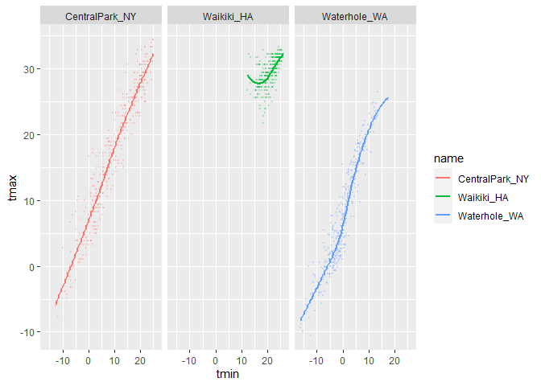
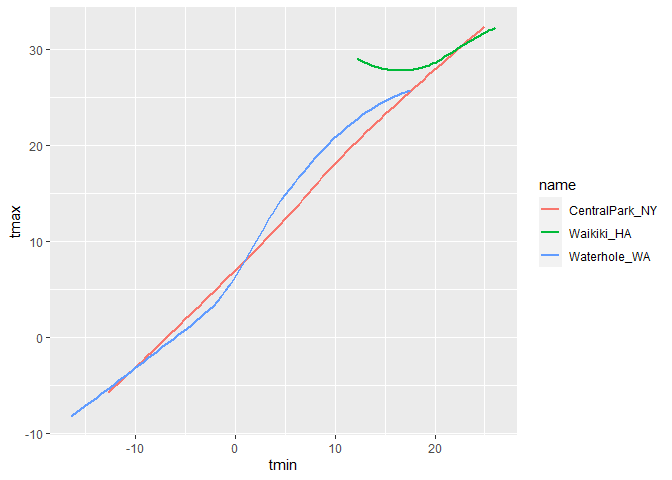
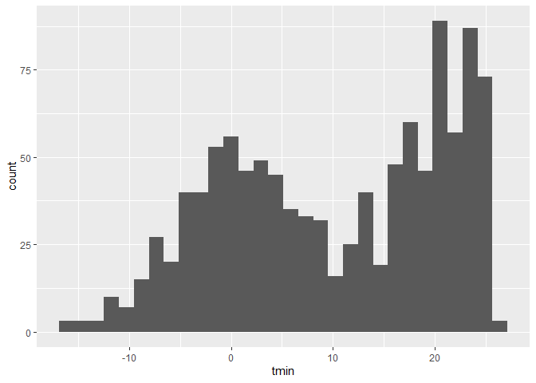
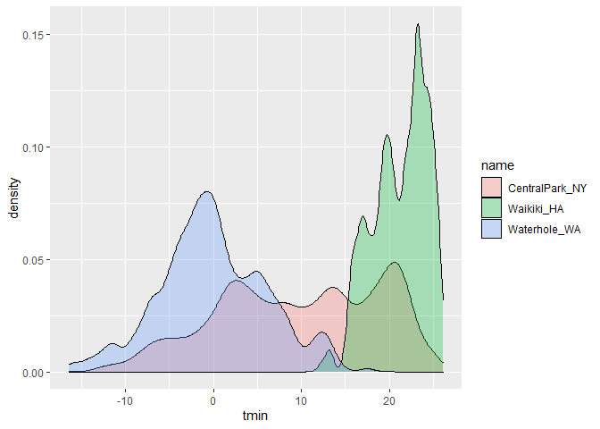
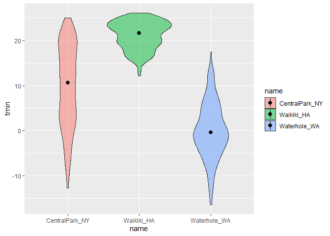

Data Import
================
Yifan Su
10/2/2020

``` r
library(tidyverse)
```

    ## -- Attaching packages ---------------------------- tidyverse 1.3.0 --

    ## v ggplot2 3.3.2     v purrr   0.3.4
    ## v tibble  3.0.3     v dplyr   1.0.2
    ## v tidyr   1.1.2     v stringr 1.4.0
    ## v readr   1.3.1     v forcats 0.5.0

    ## -- Conflicts ------------------------------- tidyverse_conflicts() --
    ## x dplyr::filter() masks stats::filter()
    ## x dplyr::lag()    masks stats::lag()

``` r
library(ggridges)
```

``` r
weather_df = 
  rnoaa::meteo_pull_monitors(
    c("USW00094728", "USC00519397", "USS0023B17S"),
    var = c("PRCP", "TMIN", "TMAX"), # temperature min and max
    date_min = "2017-01-01",
    date_max = "2017-12-31") %>%
  mutate(
    name = recode(
      id, 
      USW00094728 = "CentralPark_NY", 
      USC00519397 = "Waikiki_HA",
      USS0023B17S = "Waterhole_WA"),
    tmin = tmin / 10,
    tmax = tmax / 10) %>%
  select(name, id, everything())

weather_df
```

    ## # A tibble: 1,095 x 6
    ##    name           id          date        prcp  tmax  tmin
    ##    <chr>          <chr>       <date>     <dbl> <dbl> <dbl>
    ##  1 CentralPark_NY USW00094728 2017-01-01     0   8.9   4.4
    ##  2 CentralPark_NY USW00094728 2017-01-02    53   5     2.8
    ##  3 CentralPark_NY USW00094728 2017-01-03   147   6.1   3.9
    ##  4 CentralPark_NY USW00094728 2017-01-04     0  11.1   1.1
    ##  5 CentralPark_NY USW00094728 2017-01-05     0   1.1  -2.7
    ##  6 CentralPark_NY USW00094728 2017-01-06    13   0.6  -3.8
    ##  7 CentralPark_NY USW00094728 2017-01-07    81  -3.2  -6.6
    ##  8 CentralPark_NY USW00094728 2017-01-08     0  -3.8  -8.8
    ##  9 CentralPark_NY USW00094728 2017-01-09     0  -4.9  -9.9
    ## 10 CentralPark_NY USW00094728 2017-01-10     0   7.8  -6  
    ## # ... with 1,085 more rows

## Scatterplots\!\!

Create my first scatterplot ever.

``` r
ggplot(weather_df, aes(x = tmin, y = tmax)) + 
  geom_point()
```

<!-- -->

New apprache, same plot.

``` r
weather_df %>%  # do this to mutate or filter smthing
  ggplot(aes(x = tmin, y = tmax)) +
  geom_point()
```

<!-- -->

Save and edit a plot object.

``` r
weather_plot =
  weather_df %>% 
  ggplot(aes(x = tmin, y = tmax))

weather_plot = geom_point()
```

## Advanced scatterplot …

Start with the same one and make it fancy\!

``` r
weather_df %>% 
  ggplot(aes(x = tmin, y = tmax, color = name)) +
  geom_point() + 
  geom_smooth(se = FALSE) # standard errors
```

<!-- -->

What about the `aes` placement …?

``` r
weather_df %>% 
  ggplot(aes(x = tmin, y = tmax)) + #statics
  geom_point(aes(color = name)) + #color only applied to the scatterplot
  geom_smooth()
```

<!-- -->

Let’s facet some thing\!\!

``` r
weather_df %>% 
  ggplot(aes(x = tmin, y = tmax, alpha = tmin, color = name)) +
  geom_point(alpha = .2, size = .3) + 
  geom_smooth(se = FALSE) + # standard errors
facet_grid(. ~ name) # ignor row, create the colomns
```

<!-- -->

Let’s combine some elements and try a new plot.

``` r
weather_df %>% 
  ggplot(aes(x = date, y = tmax, color = name)) +
  geom_point(aes(size = prcp), alpha = .5) + #add precipitation
  geom_smooth(se = FALSE) +
  facet_grid(. ~ name)
```

<!-- -->

## Some small notes

How many geoms have to exist?

You can have whatever geoms you want.

``` r
weather_df %>% 
  ggplot(aes(x = tmin, y = tmax, color = name)) +
  geom_smooth(se = FALSE)
```

<!-- -->

You can use a neat geom\!

``` r
weather_df %>% 
  ggplot(aes(x = tmin, y = tmax)) +
  geom_hex() + #package `hexbin` required for `stat_binhex`
  geom_bin2d() + 
  geom_density2d() #地形图
```

<!-- -->

## Univariate plots

Histograms are really great.

``` r
weather_df %>% 
  ggplot(aes(x = tmin)) +
  geom_histogram()
```

<!-- -->

Can we add color ..

``` r
weather_df %>% 
  ggplot(aes(x = tmin, fill = name)) + 
  geom_histogram(position = "dodge") + # make it more slim
  facet_grid(. ~ name)
```

<!-- -->

Let’s try a new geometry\!

``` r
weather_df %>% 
  ggplot(aes(x = tmin, fill = name)) +
  geom_density(alpha = .3, adjust = .5) #histogram but smooth, loose a little info/ adjust=add some peak
```

<!-- -->

What about box plots?

``` r
weather_df %>% 
  ggplot(aes(x = name, y = tmin)) +
  geom_boxplot()
```

<!-- -->

Trendy plots ;-)

``` r
weather_df %>% 
  ggplot(aes(x = name, y = tmin, fill = name)) + 
  geom_violin(alpha = .5) +#boxplot likes a violin
  stat_summary(fun = "median")
```

<!-- -->

Ridge plots – the most popular plot of 2017

``` r
weather_df %>% 
  ggplot(aes(x = tmin, y = name)) + 
  geom_density_ridges() # separate = like states
```

<!-- -->
